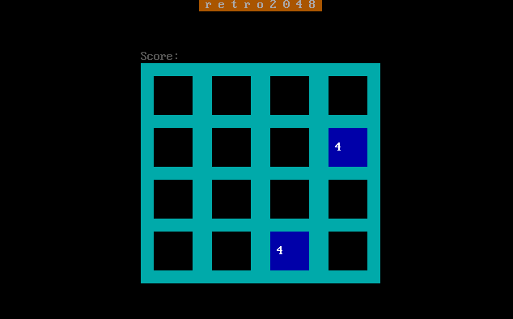

```
          _            ___   ___  _  _   ___  
         | |          |__ \ / _ \| || | / _ \ 
 _ __ ___| |_ _ __ ___   ) | | | | || || (_) |
| '__/ _ \ __| '__/ _ \ / /| | | |__   _> _ < 
| | |  __/ |_| | | (_) / /_| |_| |  | || (_) |
|_|  \___|\__|_|  \___/____|\___/   |_| \___/ 
```

This is a clone of the new classic 2048 game, written in 8086 assembly for DOS and the bootsector.



# Dependencies

 - nasm
 - make

# Building

```
make
```

This should generate three files:
 - **`r2048.com`**: the full version of the game with score and proper randomization on adding new cells, for DOS.
 - **`b2048.bin`**: bootsector version, it's a subset of the game with less features, but still fun.
 - **`b2048.com`**: the same bootsector version, but built for the DOS platform, for faster testing iterations.

# Running

The easiest way to run is via DosBox, using `r2048.com` program. The boot version can be playing with `qemu`:

```
qemu-system-i386 -fda b2048.bin
```

# License

This code is licensed under the MIT License. Please refer to `LICENSE.md` file.
